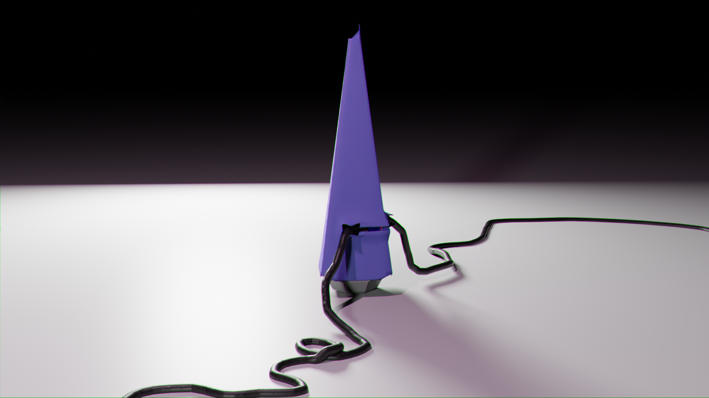
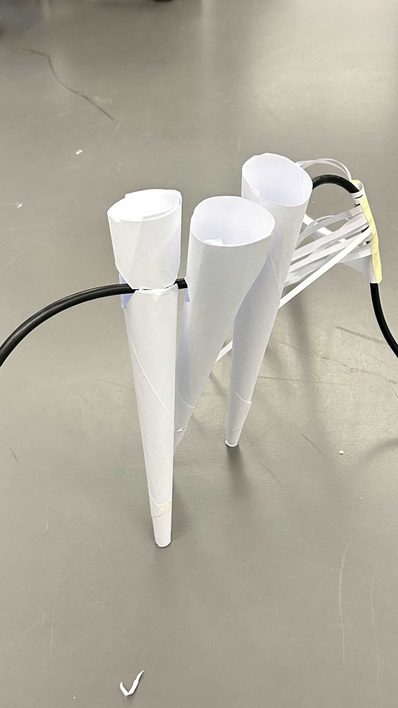
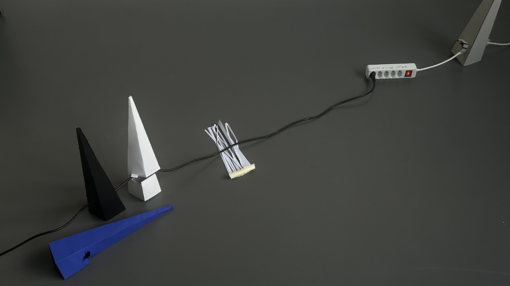
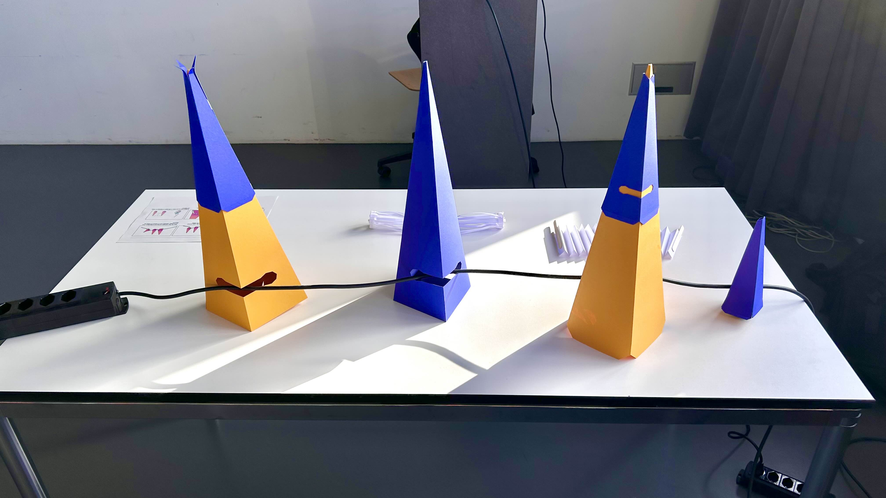

# Chakir ALI
- Soft Robots
- Master Media Design + O2R

## Little Gnomes
No longer "just cables"...

## Research Question / area of research
Within domestic contexts, how does cable placement and battery dependency affect our movements, anxiety, and spatial awareness? 

## The Pitch
Little Gnomes are cable attachments that aim to turn cables into interactive design objects, giving them life within domestic spaces.

## Prototyping research

During my research, I looked into different ways to change the usage of cables without necessarily reinventing them. 

I first did iterative research on what shapes would fit best around a cable. I quickly came with the conclusion that spines or spikes would work well for their forms.

I also aimed to introduce movement into the object’s interaction with cables. Ideas included standing upright or sliding along cables to create dynamic behaviors.
Eventually, I came up with this cone shape.

## Your key prototype

The Little Gnomes are an interactive spine that users can latch onto cables of varying sizes. They're a colony of objects that detect movements within their areas. Once they do, they begin emitting different behaviors depending on people's placements, the way they treat cables, etc... It exists to enforce boundaries created by cables. Previously implicit, I aim to make them explicit and perhaps ludicrous.

-- VIEW THE VIDEO --

## User scenario

## Next Steps

Definitely change the shape a bit more... After that, think of ways to do as many movements as possible with the robot, using minimal materials...
I'd like to give each shape a personnality.
he detection mechanism has been finished and tuned up. Now the only thing left is figuring out how a single servo can move all those parts. 