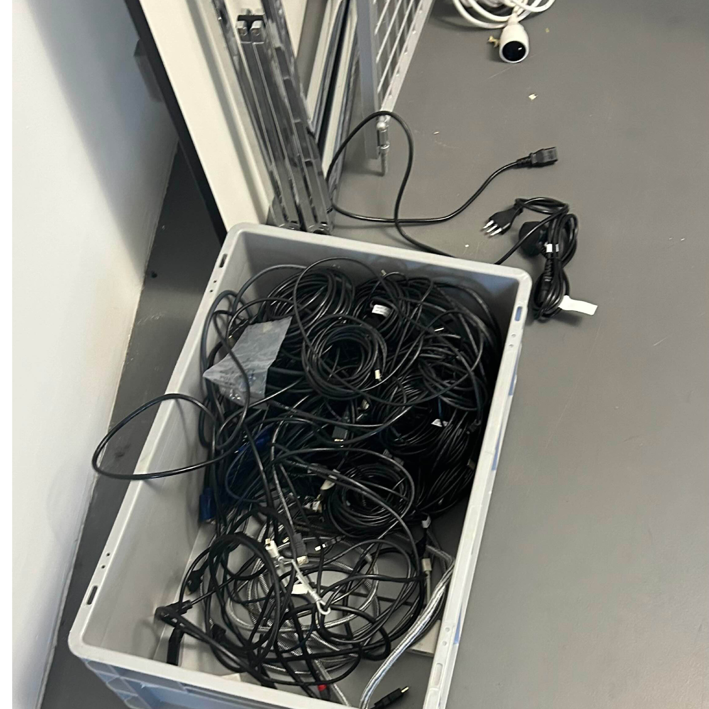
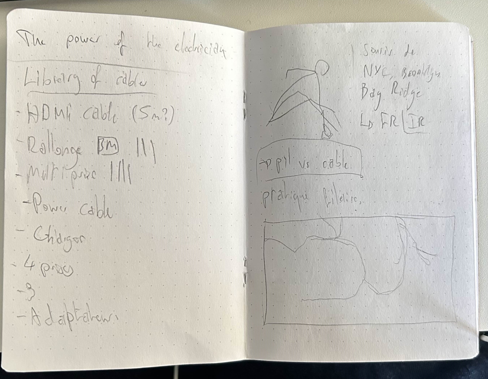
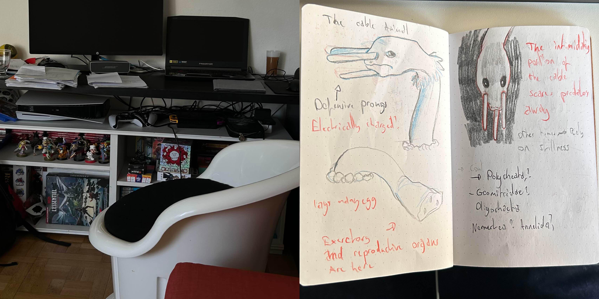
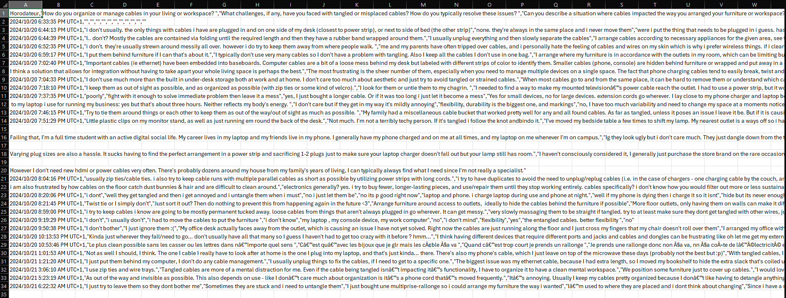
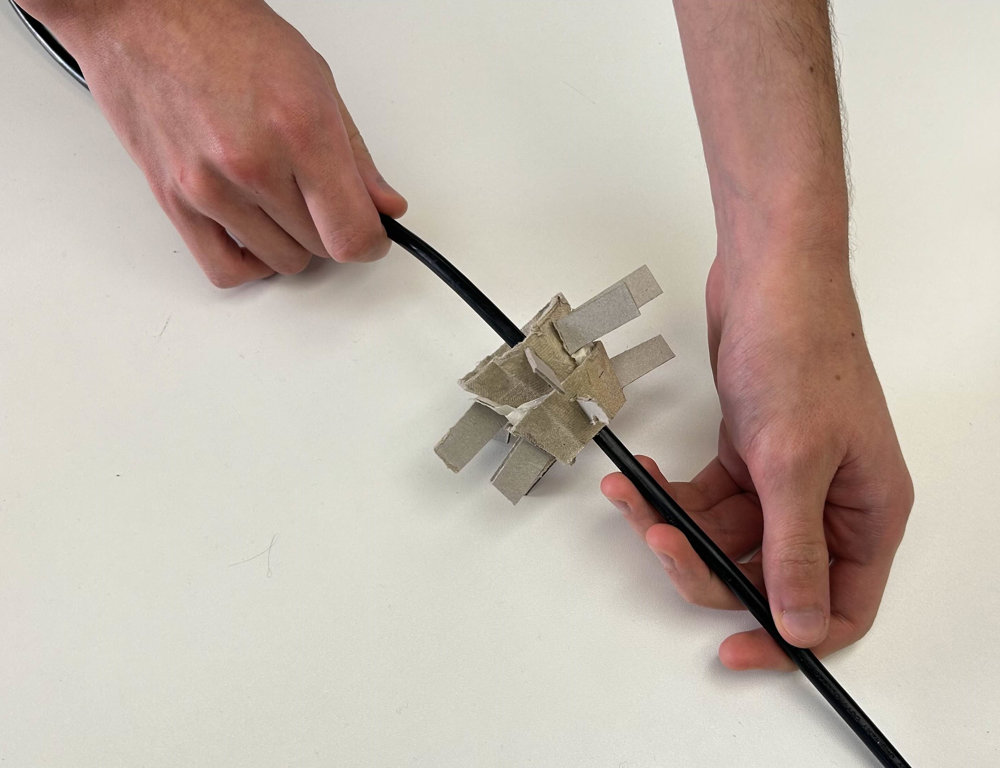
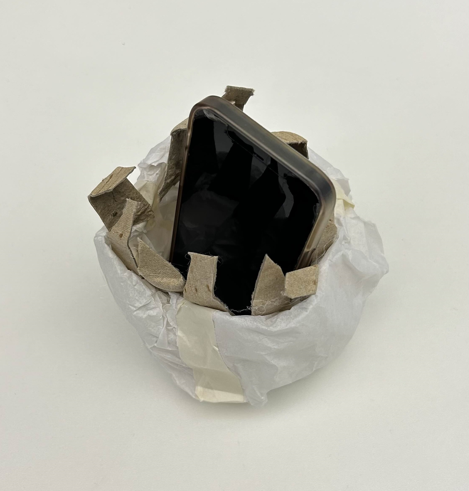
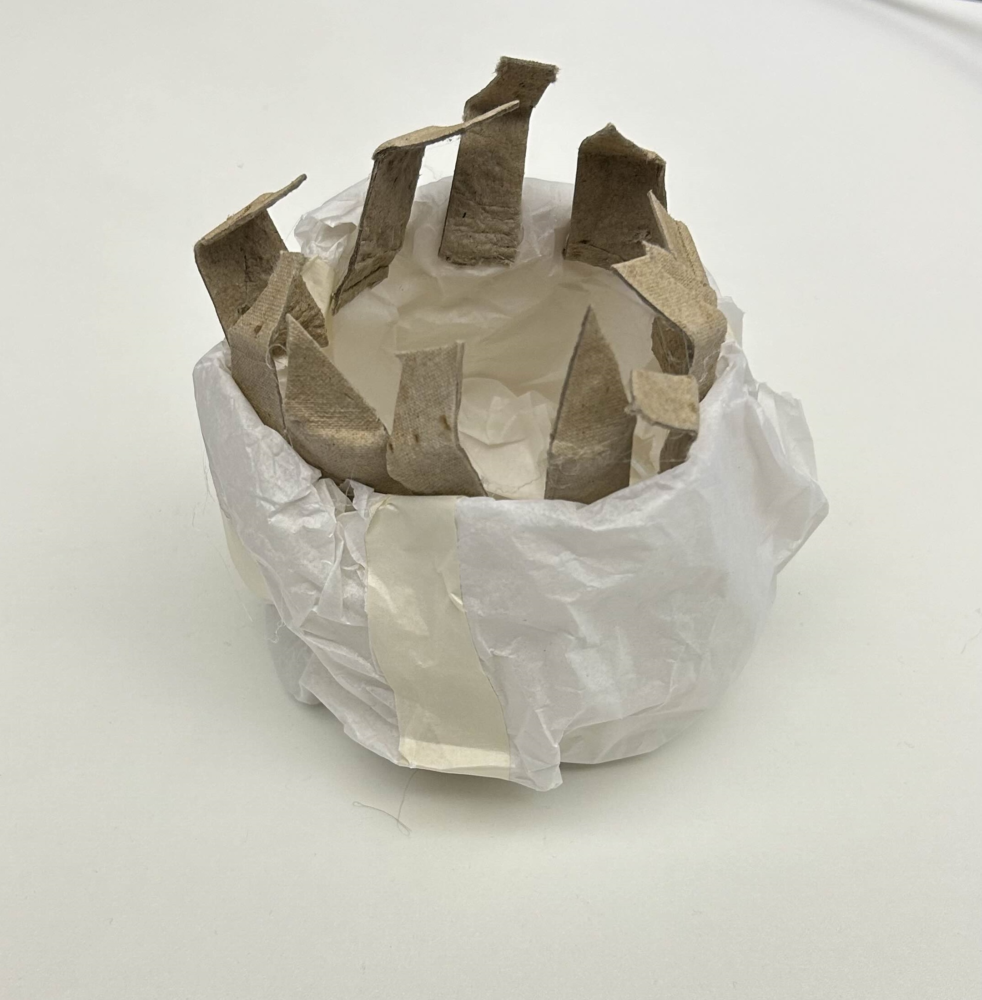
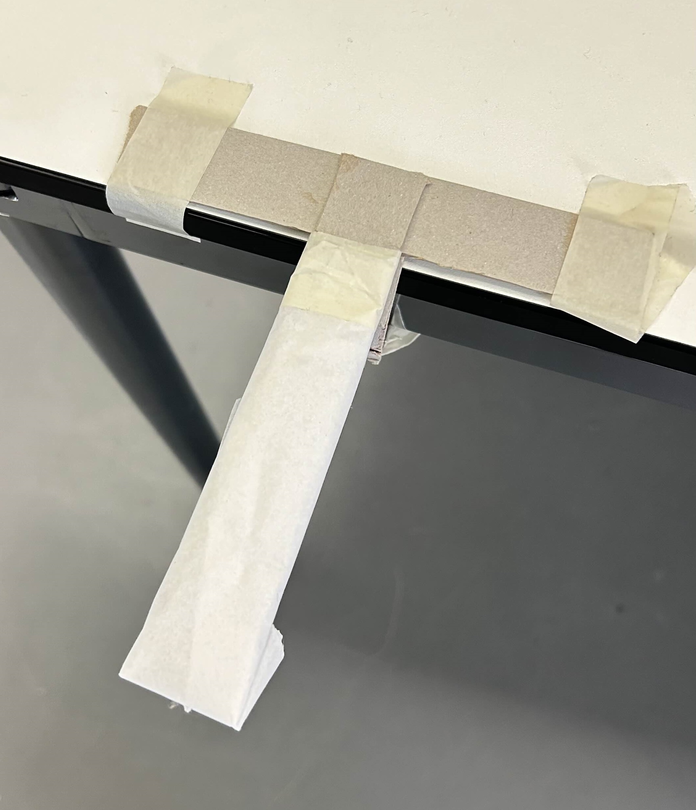

# Chakir ALI
- Soft Robots
- Master Media Design + O2R

## Area of Intervention
Our relationship with cables

## Research Question

What roles do cables play in visualising/defining boundaries and dependencies to energy?

Within domestic contexts, how does cable placement and battery dependency affect our movements, anxiety, and spatial awareness? 

## Research

Observations focused on shared living spaces, mine or friends', trying to answer the following question:
### Why are objects placed where they are?

_The culprits were always related to **cables and outlets** in some way._

 I explored how individuals perceive and interact with cables in their daily routines. (Through observations, user surveys, user interviews, observational drawings, and mapping exercises)

Survey responses expressed mixed approaches to cable management, with participants either tolerating visible cables until they became obstructive, or keeping them out of sight altogether. Responses also highlighted dependency on battery life, particularly for essential devices, impacting daily habits and positioning within spaces (including the placement of furnitures).
 
 People generally expressed a preference for flexibility, durability, and cable length, with some showing interest in new designs, but only if they improved convenience.

## Insights

- _Cables can serve as implicit spatial dividers,_ invisible boundaries that divide areas into sections...
- _Battery anxiety shapes user behavior,_ with people developing routines and stress around charging devices...
- _Cables form a tethered extension of the self,_ where an individual's reach and "existence" extends to the length of the cables they're connected to, influencing their perceived comfort zones...

## First Ideas & Prototypes

### **Cable Paralinkers**
A colony of robotic sections that latch onto cables at home, and use their spines to move away from the users.

---

### **Digest Charger**

A sea anemone-like creature that takes hold of your electrical appliances that are out of batteries, and digests them to charge them until they are back at 100%.

---

### **Boundary Extenders**
Malleable appendages extend the boundaries of walls or tables. 
They move up and down the closer and faster someone gets nearer, playing with and reshaping the boundaries of their intervention on the world. 

## Next Steps

Focus on refining the prototypes to emphasize on the following points:
- Answering the questions better - Am I trying to erase the rules, ennhance them? Change the way we move? Should I create a new space, devoid of any cables? What words do we use to defines those areas?

- What would the world look like with new movements around cables? Pulling, stretching, retracting, loosening, cutting, squashing...?

- Emphasize user interaction.
