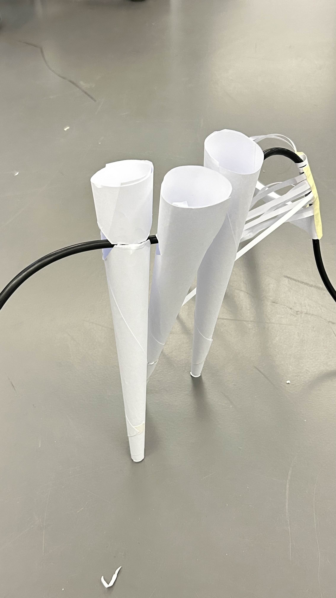

# Notes

## Different references

Zimoun Installations

Different toys (chenille, etc)

 Videos of snake-like soft robots.
https://www.youtube.com/watch?v=ZPpJp0muSDA

https://www.youtube.com/watch?v=nS73hdA0paQ
 

## More dev
Trying to develop different mechanismes for the cables to stand up.

Finding scenarios to include those machines (putting them on cables all around installation, or creating a crocodile game like contraption? like does it trigger, does it note trigger)

## Images  ahoy

More later
