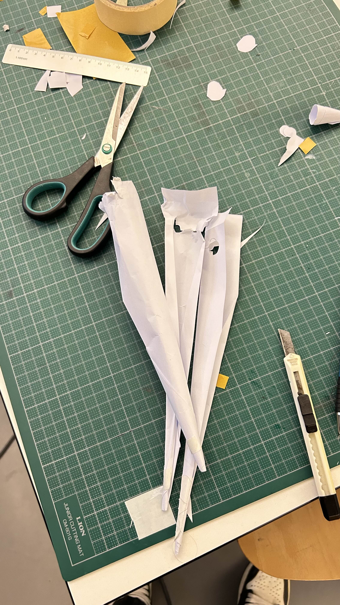
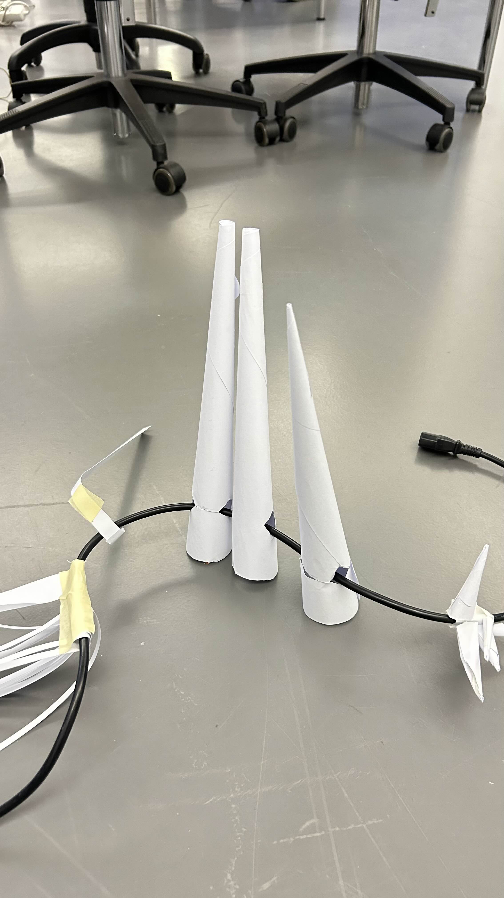
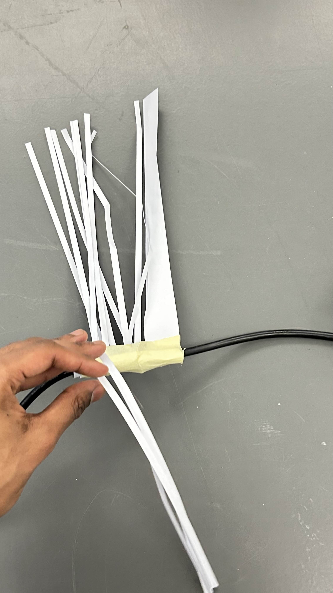
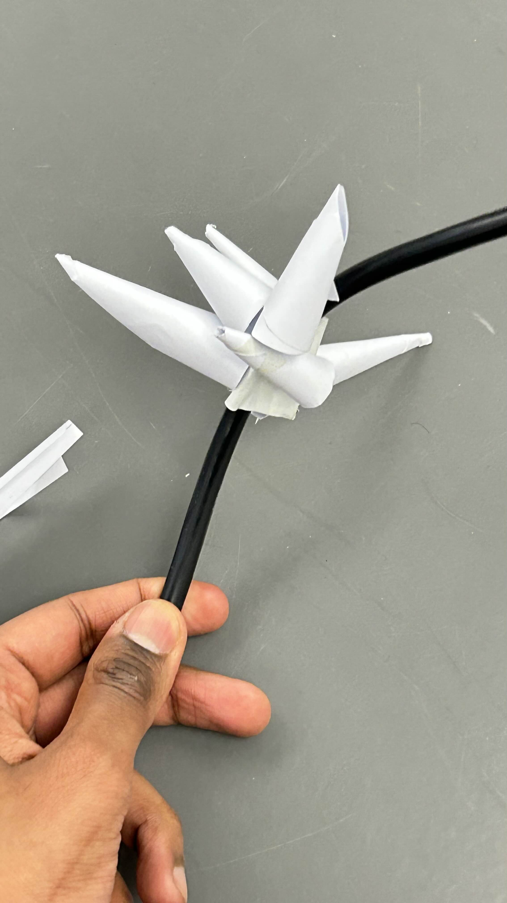
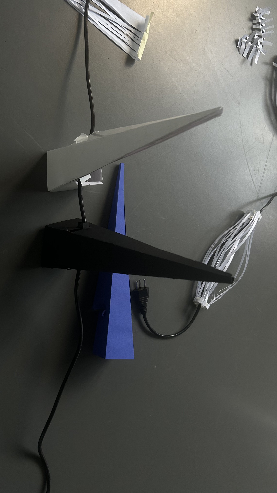
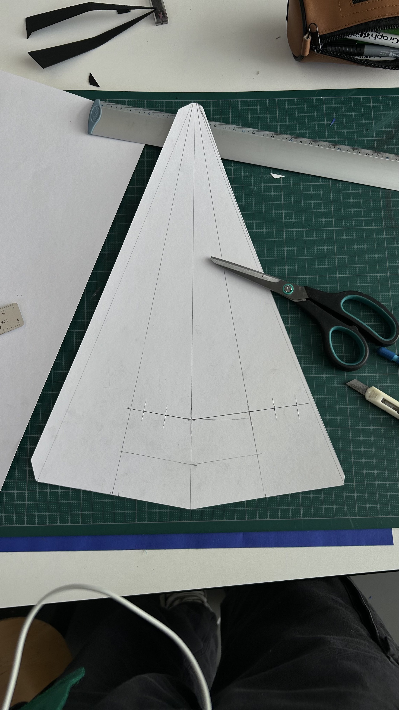
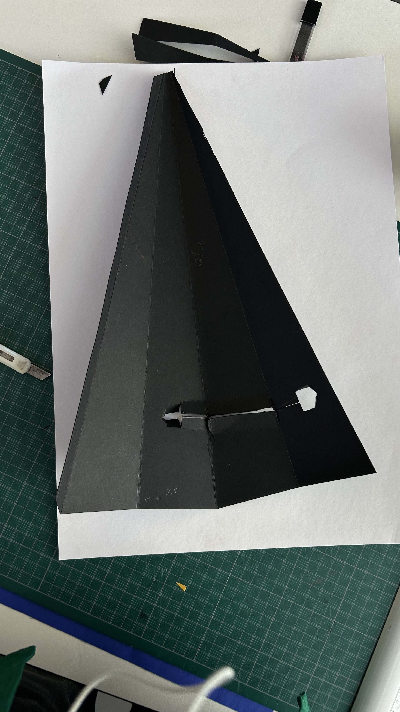

# Notes

## Different references

Zimoun Installations

Different toys (chenille, etc)

 Videos of snake-like soft robots.
https://www.youtube.com/watch?v=ZPpJp0muSDA

https://www.youtube.com/watch?v=nS73hdA0paQ
 

## More dev
Trying to develop different mechanismes for the cables to stand up.

Finding scenarios to include those machines (putting them on cables all around installation, or creating a crocodile game like contraption? like does it trigger, does it note trigger)

## Images  ahoy

First steps of objects going around the cables.

The first addons were slinging, snakey addons on cables that would slith around the cables. Although, there is a lot of friction so movement may be hindered depending on the ground surface.

Different textures for the paper would be interesting to observe.

Now we can see modular pieces that make the cables gain in height? Spikes? Sort of like Cable Paralinkers but less small.

# Final looks for the week?

This object seems fine on its own.

Although I can also say that different sizes would be better. I also think it would be better if there were more modular aspects to the prototype?
What if the object was made up of two legs? What if it could hold itself up every which way? What if the rotations happened on a different axis?