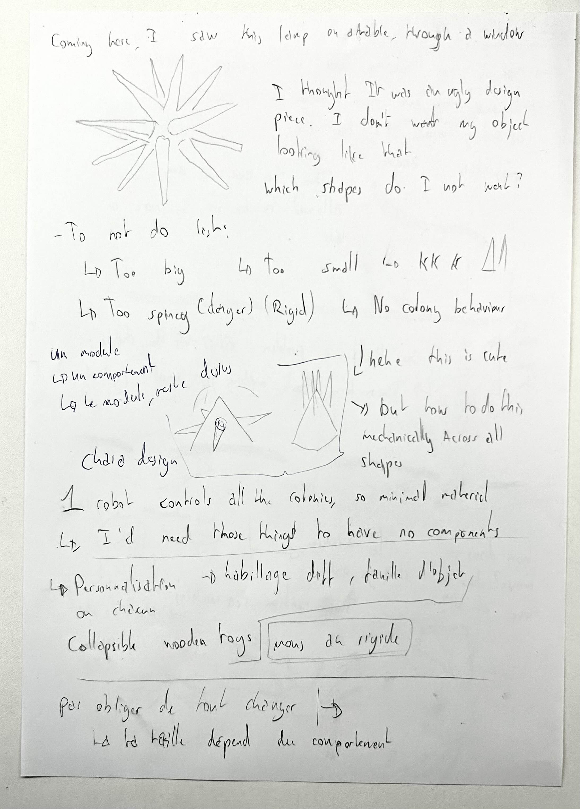

# Shape research

I talked with Laure and Pabloe. We talked about how, while the shapes could be made a bit smaller, I could also push it more in terms of 2chara design"
Give each little gnomes new forms, shapes, differences between one another to give them character.

Eventually, I went to work on my Rhino files, and left to print some papers and cut them on the Zund

It was awful.

I tried to get a module that would fold on its own and be more malleable. I failed at that. It was a good thing I tried anyways.