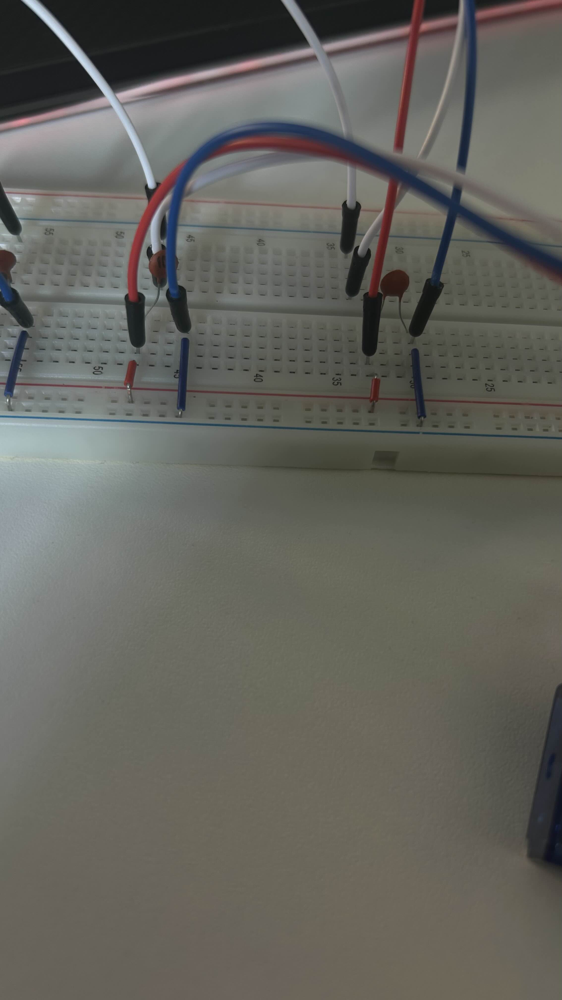
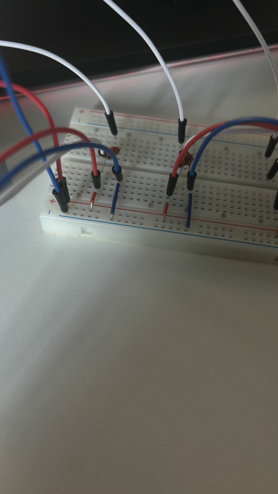
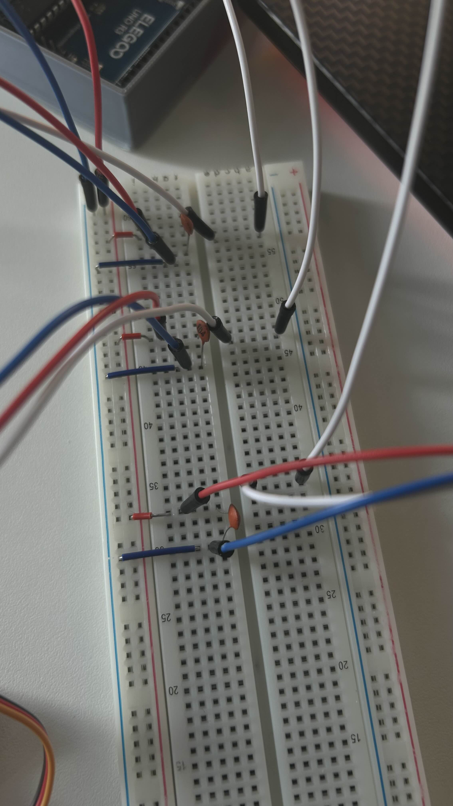
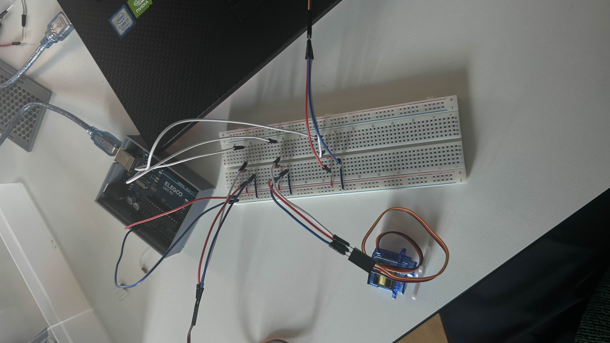
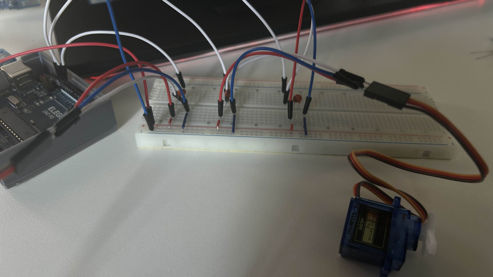
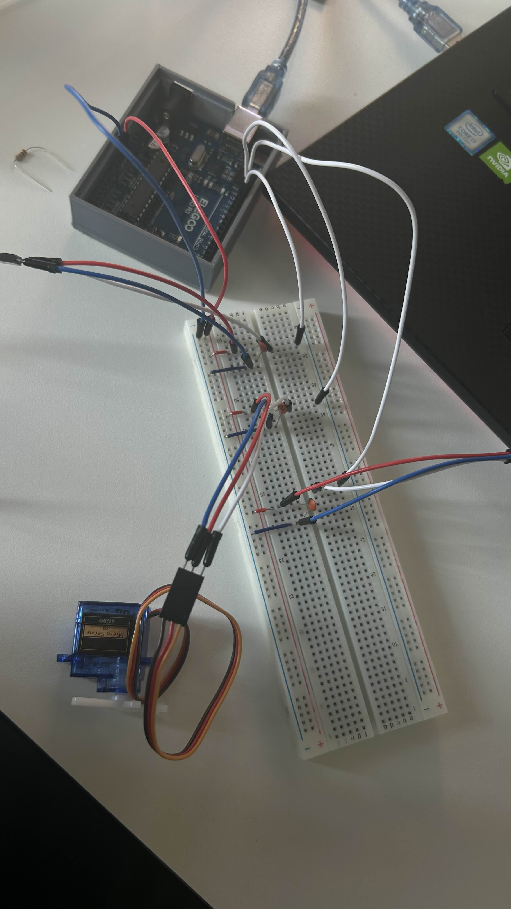
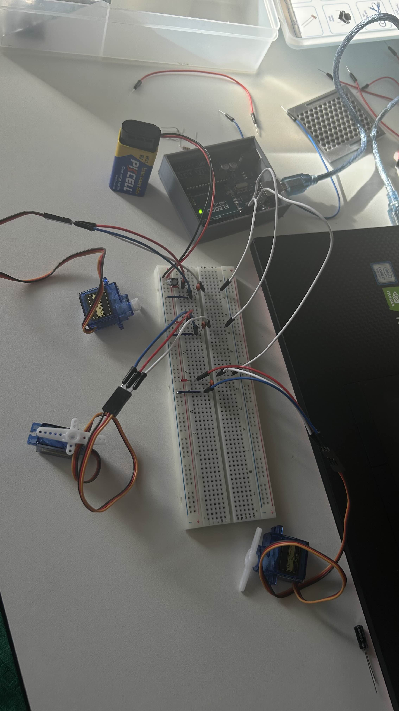
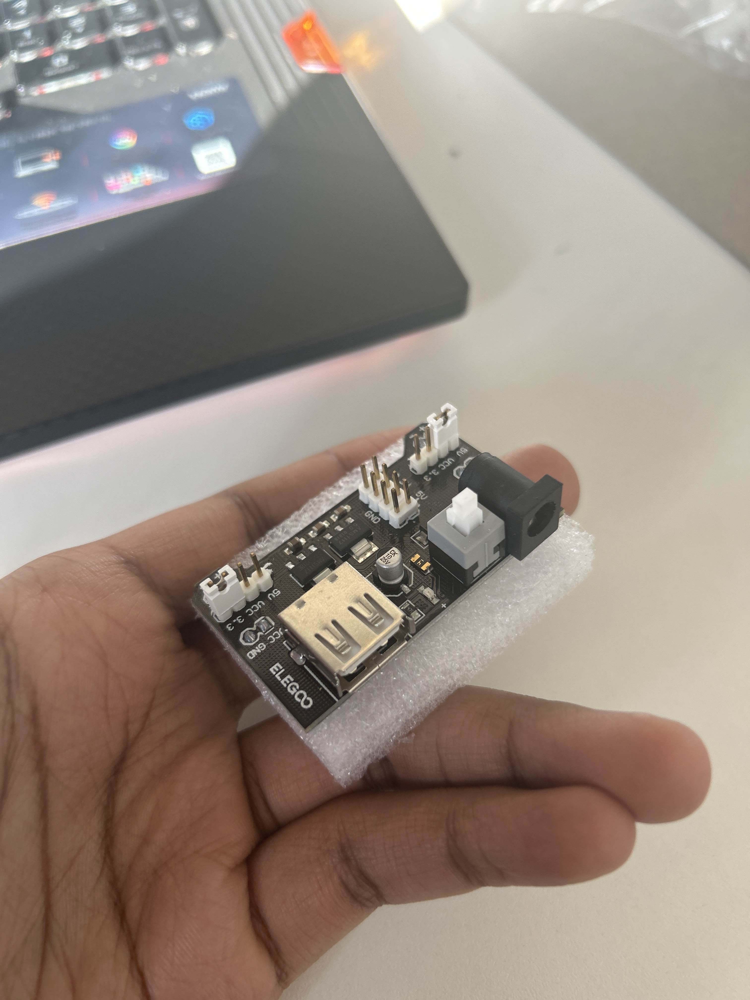

# More Programming

I took some time to work a bit more on the programmation of the robot. Most specifically the circuitry between the servos.
In theory, the servo code works wonderfully. 

The only issue is the energy being provided. The 3 servos in serie reqquire too much energy. Perhaps I could have them all connected to differrent energy supplies, but that is another hurdle on its own. 

Technically, I could employ a small button system with a small battery and just work with the signal cable.

External 9V battery didn't work. The way I plugged everything in is also horrendous, and I really incurred the risk of burning my arduino module.

great so good news
my servo motors turn 360° so i don't need to buy new ones
but the two servos i gave to teachers to help them repair their broken installations were returned to me in the form of two new servos that only do 180 rotations.
so i'll have to have them fix that.
and also. i need a good power supply for those servos
so an external usb power bank. i already have a power supply module which helps. but i need to get that other thing.
if i keep using my arduino to provide power i'm going to burn smth and break the machine